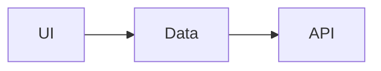

# [Title] — Implementation Plan

## Brief (approved)

(Copy brief table from `.cursor/plans/_briefs/{slug}.brief.md`)

---

## Scope

**Included:**

**Excluded:**

**Reference:**

---

## UI pattern (conditional)

Fill based on brief `ui_pattern` / `component_library`:

| Screen | Component | Config / file |
|--------|-----------|---------------|
| | | |

Write a checklist for the chosen library + css_stack.

---

## Architecture



---

## 1. UI

| File | Responsibility |
|------|----------------|

---

## 2. Data layer

| Source | Strategy |
|--------|----------|
| brief.data_source | |

---

## 3. Integration

- Routes / navigation
- Auth (brief.auth)
- i18n (brief.i18n)

---

## Verification

Template: [verification.md](../_shared/verification.md)

### Automated

(project commands — e.g. `pnpm test`, `pnpm build`)

### Scenarios (if UI)

| # | Scenario | Expected |
|---|----------|----------|

---

## Target file tree

```
...
```
