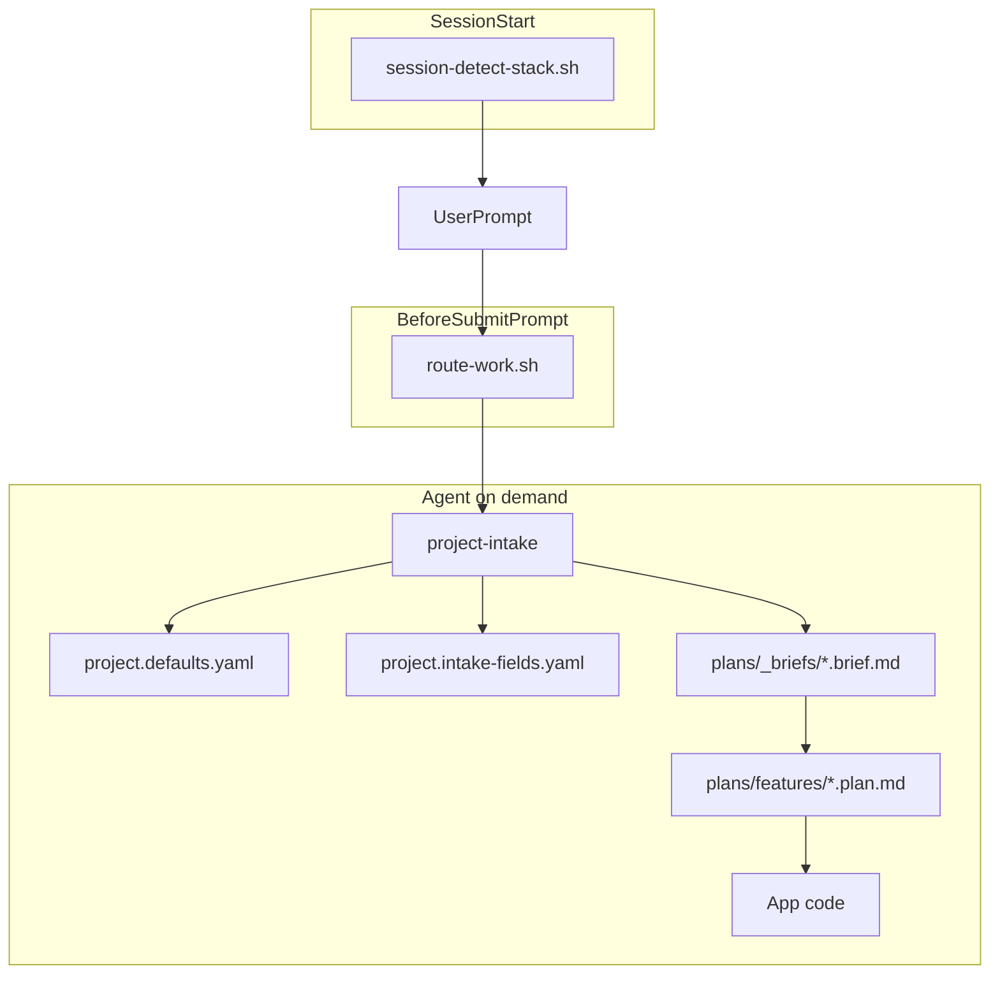

# Cursor Agent Kit

**English** · [Türkçe](README.tr.md)

Portable **`.cursor/`** template for Cursor IDE — agent orchestration for any repo, not application code.

It replaces ad-hoc AI prompts with a repeatable pipeline: **infer requirements → brief → plan → implement**, backed by team defaults, hooks, rules, and specialized skills.

Install into any project with one script. Configure once in git. Every session inherits the same standards.

## Why use this kit

Without structure, AI coding assistants tend to skip requirements, mix planning with implementation, and pick inconsistent stacks. This kit addresses that with concrete artifacts and automation:

- **Structured intake before code** — [route-work.sh](.cursor/hooks/route-work.sh) lazy-loads [project-intake/SKILL.md](.cursor/skills/project-intake/SKILL.md) on greenfield/plan/design; infer repo signals, ask only missing fields via `AskQuestion`, save approved [briefs](.cursor/plans/_briefs/).
- **Plan/implement separation** — During implementation the plan body stays read-only; only `todos[].status` changes ([feature-plan.template.md](.cursor/plans/_templates/feature-plan.template.md)).
- **Team standards in git** — [project.defaults.yaml](.cursor/config/project.defaults.yaml) holds locale, architecture, stack, and intake rules; [project.intake-fields.yaml](.cursor/config/project.intake-fields.yaml) holds the AskQuestion catalog (loaded on intake only). Resolution order: **user prompt → repo signals → config defaults → AskQuestion**.
- **Automatic skill routing** — [route-work.sh](.cursor/hooks/route-work.sh) plus [registry.json](.cursor/skills/claude-skills-router/registry.json) match intent (greenfield, design, scaffold, API review, secops, etc.) without typing `@skill` every time.
- **Behavioral guardrails** — Single always-on rule [core.mdc](.cursor/rules/core.mdc) (~350 tokens); glob rules [quality-standards.mdc](.cursor/rules/quality-standards.mdc) apply on UI files only.
- **Context visibility** — Each prompt shows active rules/skills and estimated token cost on screen ([route_engine.py](.cursor/hooks/lib/route_engine.py), [context-manifest.json](.cursor/config/context-manifest.json)).
- **Verification built-in** — [verification.md](.cursor/plans/_shared/verification.md) is referenced on the implement path via hooks.
- **Automatic screen testing + docs** — when a UI screen changes, [screen-test-protocol/SKILL.md](.cursor/skills/screen-test-protocol/SKILL.md) drives `cursor-ide-browser` (login, click, fill, create/edit/delete) and writes per-screen test docs under `user_test/<app>/`.
- **Project-agnostic** — Works on Node, .NET, Python, Go, and monorepos; stack is detected at session start ([session-detect-stack.sh](.cursor/hooks/session-detect-stack.sh)).

## How it works

Hooks inject context before each prompt when intent matches. One always-on rule (`core.mdc`). Skills execute specialized workflows on demand.



### Hooks reference

| Event | Script | Effect |
|-------|--------|--------|
| `sessionStart` | `session-detect-stack.sh` | Injects `[Stack:…]` repo signals (compact) |
| `beforeSubmitPrompt` | `log-task-start.sh` | Logs task start time to `.cursor/logs/agent-activity.log` + on-screen note |
| `beforeSubmitPrompt` | `route-work.sh` | Intent + skill router + on-screen context report |
| `beforeReadFile` | `track-context-read.sh` | Track rules/skills actually read this session |
| `stop` | `log-task-end.sh` | Logs task end time + duration |

Activity log records start/end timestamps and duration per task. Token/cost usage is **not** available to hooks — view it in Cursor's **Settings → Usage** or the per-message indicator.

## Quick start

### macOS / Linux

```bash
# 1. Clone (once)
git clone https://github.com/YOUR_USER/cursor-agent-kit.git
cd cursor-agent-kit

# 2. Install into your project
./install.sh /path/to/your-project

# 3. Configure defaults (locale, stack, architecture)
# Edit: your-project/.cursor/config/project.defaults.yaml
```

### Windows

```cmd
git clone https://github.com/YOUR_USER/cursor-agent-kit.git
cd cursor-agent-kit

install.bat C:\path\to\your-project
REM or: install.bat . --force
```

Then open **your project** in Cursor. Hooks under `.cursor/hooks.json` load automatically.

## Install options

| Command | Effect |
|---------|--------|
| `./install.sh ~/dev/my-app` | Copy `.cursor/` into `my-app/.cursor/` (macOS/Linux) |
| `install.bat C:\dev\my-app` | Same on Windows |
| `./install.sh .` / `install.bat .` | Install into current directory |
| `... --force` | Replace existing `.cursor` (old → `.cursor.bak.<timestamp>`) |

### Without cloning (one-liner)

```bash
git clone --depth 1 https://github.com/YOUR_USER/cursor-agent-kit.git /tmp/cursor-agent-kit
/tmp/cursor-agent-kit/install.sh /path/to/your-project
```

### Git submodule (team pin)

```bash
cd your-project
git submodule add https://github.com/YOUR_USER/cursor-agent-kit.git .cursor-kit
.cursor-kit/install.sh . --force   # or symlink: ln -s .cursor-kit/.cursor .cursor
```

## After install — configure

Edit **`your-project/.cursor/config/project.defaults.yaml`**:

```yaml
locale:
  chat: turkish              # reply language
  plan: english              # brief and plan file language
  ask_question_labels: english

architecture:
  default: fullstack-separated
  frontend:
    default_language: typescript
    default_framework: react
  backend:
    default_language: csharp-dotnet
    default_framework: aspnet-core
```

Resolution order: **user prompt → repo signals → config defaults → AskQuestion** for missing fields.

Details: [config/README.md](.cursor/config/README.md)

## What gets installed

| Path | Role |
|------|------|
| `config/` | Team defaults + intake field catalog |
| `rules/core.mdc` | Single always-on agent behavior (~350 tokens) |
| `rules/*.mdc` | Lazy/glob rules (intake workflow, quality, screen tests) |
| `hooks/` + `hooks.json` | sessionStart + beforeSubmitPrompt automation |
| `skills/` | Specialized workflows (intake, plan, design, scaffold, secops, …) |
| `plans/_briefs/` | Generated requirement briefs (per project) |
| `plans/features/` | Generated implementation plans |
| `plans/_shared/` | Canonical options, locale, verification |
| `plans/_templates/` | Brief, plan, and design templates |

The installer also scaffolds a sibling **`user_test/`** folder (screen-test docs + generic templates) into the target project; per-app docs are generated on demand and never clobbered on re-install.

**Deep dive:** [.cursor/README.md](.cursor/README.md) · [config/README.md](.cursor/config/README.md)

## Included skills

Skills are instruction files that tell the agent **how to behave** for a specific job type. [route-work.sh](.cursor/hooks/route-work.sh) auto-routes via [registry.json](.cursor/skills/claude-skills-router/registry.json); you can also invoke any skill manually with `@skill-name`.

### Core workflow skills

These drive the **brief → plan → code** pipeline.

| Skill | Purpose | When to use |
|-------|---------|-------------|
| [project-intake](.cursor/skills/project-intake/SKILL.md) | Gather requirements before coding: infer repo + prompt, ask missing fields via `AskQuestion`, save approved brief to `plans/_briefs/*.brief.md`, then route to the right next skill. | Greenfield, new feature, plan/design/scaffold — when no brief exists yet. |
| [implementation-plan](.cursor/skills/implementation-plan/SKILL.md) | Write an implementation plan from an approved brief (screen inventory, gap analysis, todos). Does **not** write app code. | "Create plan", "implementation plan" — **not** "implement the plan". |
| [design-intake](.cursor/skills/design-intake/SKILL.md) | UI/design intake: aesthetic, theme, motion, component stack; produces `plans/design-*.plan.md`. | "Design", "mockup", "redesign", "build UI". |
| [module-scaffolder](.cursor/skills/module-scaffolder/SKILL.md) | Scaffold a new module/screen from brief: stack-aware file tree (pages, routes, CRUD forms, API endpoints). | "Scaffold", "new module", "new screen", "add feature". |
| [focused-fix](.cursor/skills/focused-fix/SKILL.md) | Systematic end-to-end repair of a broken feature/module — trace dependencies, logs, tests, config across layers. **Not** for single-line bug fixes. | "Make X work", "fix the Y feature", "module is broken", "debug end-to-end". |
| [screen-test-protocol](.cursor/skills/screen-test-protocol/SKILL.md) | Browser smoke tests via `cursor-ide-browser` (login, click, fill, CRUD) + per-screen Markdown docs under `user_test/<app>/`. | After UI changes, "screen test", "smoke test", "test docs". |

### Specialist skills

Deep guidance for specific technical domains. Hook-routed when prompt keywords match.

| Skill | Purpose | When to use |
|-------|---------|-------------|
| [api-design-reviewer](.cursor/skills/api-design-reviewer/SKILL.md) | REST API design review: naming, HTTP methods, status codes, breaking changes, OpenAPI/Swagger, versioning, error formats, design scorecard. | API PR review, v2 migration, new/changed endpoints. |
| [dependency-auditor](.cursor/skills/dependency-auditor/SKILL.md) | Dependency audit: CVEs, transitive risks, license conflicts, safe upgrade paths across ecosystems. | "CVE", "npm audit", pre-release audit, license compliance. |
| [ci-cd-pipeline-builder](.cursor/skills/ci-cd-pipeline-builder/SKILL.md) | Generate CI/CD pipelines from detected stack signals (GitHub Actions, GitLab CI; lint/test/build/deploy). | "Set up CI", "create pipeline", "GitHub Actions". |
| [codebase-onboarding](.cursor/skills/codebase-onboarding/SKILL.md) | Analyze repo and produce onboarding docs: architecture, key files, local setup, contribution checklist. | New engineer/contractor, "how does this repo work", architecture overview. |
| [database-schema-designer](.cursor/skills/database-schema-designer/SKILL.md) | Database schema design: ERD, normalization, migrations (Drizzle/Prisma/TypeORM/Alembic), indexes, RLS, seed data. | "ERD", "schema design", "plan migration", table relationships. |
| [senior-secops](.cursor/skills/senior-secops/SKILL.md) | Application security & SecOps: SAST, OWASP Top 10, secret scanning, threat modeling, hardening, SOC2/PCI/HIPAA/GDPR checks. | Security scan, pentest prep, vulnerability management, incident response. |

### Hook trigger phrases

Matched automatically from [registry.json](.cursor/skills/claude-skills-router/registry.json). Phrases support English and Turkish.

| Skill | Triggers (examples) |
|-------|---------------------|
| project-intake | greenfield, sıfırdan, from scratch |
| module-scaffolder | scaffold, yeni modül, new screen |
| focused-fix | fix feature, uçtan uca, broken |
| implementation-plan | plan oluştur, implementation plan |
| design-intake | tasarım, mockup, redesign |
| api-design-reviewer | openapi, REST API, breaking change |
| dependency-auditor | CVE, npm audit, license |
| ci-cd-pipeline-builder | GitHub Actions, pipeline |
| codebase-onboarding | onboarding, repo overview |
| database-schema-designer | ERD, schema migration |
| senior-secops | security scan, pentest, hardening |
| screen-test-protocol | ekran testi, screen test, smoke test |

### Available via @skill

Not in the hook registry; invoke manually when needed:

| Skill | Purpose |
|-------|---------|
| [handoff](.cursor/skills/handoff/SKILL.md) | Compact the current conversation into a handoff doc for the next session; redacts secrets; references existing briefs/plans instead of duplicating them. |
| [mcp-server-builder](.cursor/skills/mcp-server-builder/SKILL.md) | Build production-ready MCP servers from OpenAPI (Python or TypeScript); expose REST APIs as typed agent tools. |
| [cursor-guidelines](.cursor/skills/cursor-guidelines/SKILL.md) | Stub reminder — canonical discipline text lives in [core.mdc](.cursor/rules/core.mdc). |

## Typical workflow

1. **Greenfield / new feature** → agent runs intake → `plans/_briefs/*.brief.md`
2. **Plan** → `plans/features/*.plan.md` (approval before code)
3. **Implement the plan** → code in your app; only plan `todos[].status` changes

**Intake is skipped when:**

- You say `implement the plan` / `Planı uygula` (uses existing plan)
- You say `skip intake` / `intake atla` (config defaults only; your responsibility)
- A matching `plans/_briefs/*.brief.md` already exists
- The task is a scoped bugfix or refactor

**Example prompts:**

- `Sıfırdan Next.js admin paneli planla`
- `Planı uygula` (uses existing plan; skips intake)
- `skip intake` (use config defaults only)

## Repository layout (this repo)

| Path | Purpose |
|------|---------|
| `.cursor/` | Template copied to consumer projects |
| `user_test/` | Screen-test docs seed (templates + index) copied alongside `.cursor/` |
| `install.sh` | Installer (macOS / Linux) |
| `install.bat` | Installer (Windows) |
| `README.md` | English documentation |
| `README.tr.md` | Turkish documentation |

## Publish to GitHub

```bash
cd cursor-agent-kit
git init
git add .
git commit -m "Initial commit: Cursor agent kit template"
git branch -M main
git remote add origin https://github.com/YOUR_USER/cursor-agent-kit.git
git push -u origin main
```

## Updating an existing project

```bash
cd cursor-agent-kit && git pull
./install.sh /path/to/your-project --force
# Re-apply your project.defaults.yaml changes if overwritten (backup first)
```

`--force` replaces the whole `.cursor` tree (old copy backed up to `.cursor.bak.<timestamp>`). Back up or document your `project.defaults.yaml` diffs before updating.

## License

MIT (add LICENSE file if you need one)
