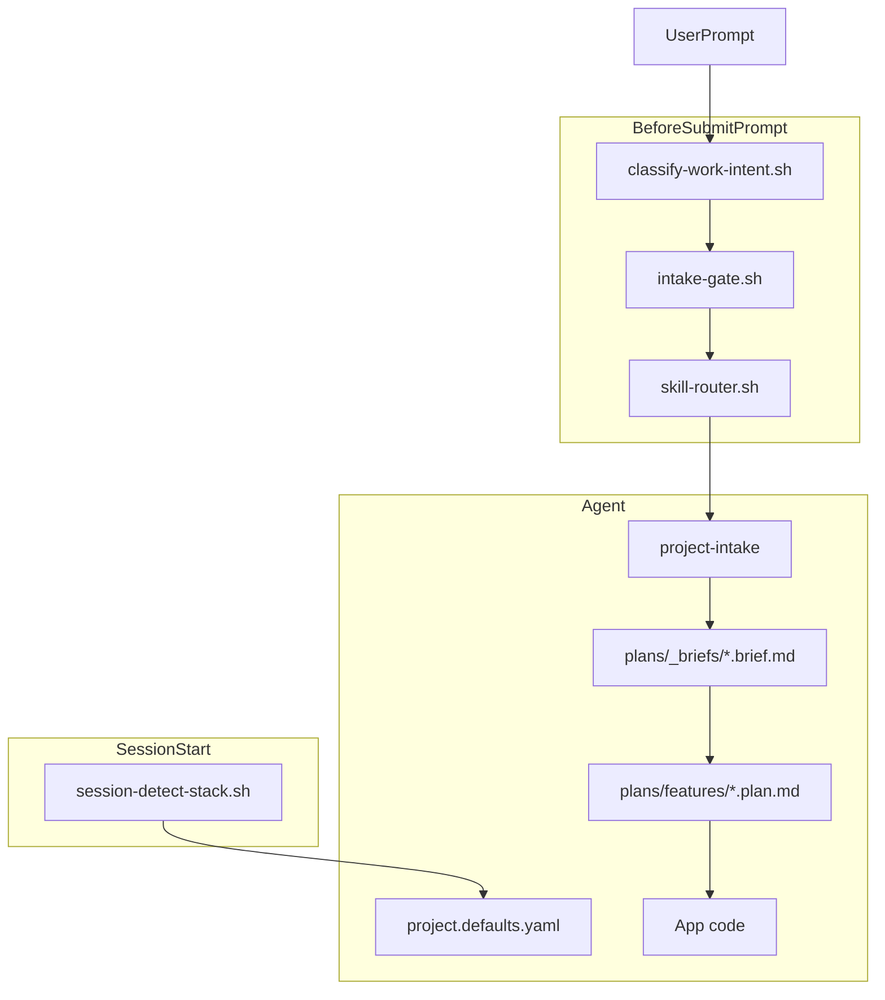

# Cursor Agent Kit

**English** · [Türkçe](README.tr.md)

Portable **`.cursor/`** template for Cursor IDE — agent orchestration for any repo, not application code.

It replaces ad-hoc AI prompts with a repeatable pipeline: **infer requirements → brief → plan → implement**, backed by team defaults, hooks, rules, and specialized skills.

Install into any project with one script. Configure once in git. Every session inherits the same standards.

## Why use this kit

Without structure, AI coding assistants tend to skip requirements, mix planning with implementation, and pick inconsistent stacks. This kit addresses that with concrete artifacts and automation:

- **Structured intake before code** — [project-intake-workflow.mdc](.cursor/rules/project-intake-workflow.mdc) and [project-intake/SKILL.md](.cursor/skills/project-intake/SKILL.md) infer repo signals, ask only missing fields via `AskQuestion`, and save approved [briefs](.cursor/plans/_briefs/).
- **Plan/implement separation** — During implementation the plan body stays read-only; only `todos[].status` changes ([feature-plan.template.md](.cursor/plans/_templates/feature-plan.template.md)).
- **Team standards in git** — [project.defaults.yaml](.cursor/config/project.defaults.yaml) holds locale, architecture, stack, and intake rules. Resolution order: **user prompt → repo signals → config defaults → AskQuestion**.
- **Automatic skill routing** — Hooks plus [registry.json](.cursor/skills/claude-skills-router/registry.json) match intent (greenfield, design, scaffold, API review, secops, etc.) without typing `@skill` every time.
- **Behavioral guardrails** — Always-on rules: [cursor-guidelines.mdc](.cursor/rules/cursor-guidelines.mdc) (simplicity, surgical diffs), [quality-standards.mdc](.cursor/rules/quality-standards.mdc), [output-locale.mdc](.cursor/rules/output-locale.mdc).
- **Verification built-in** — [verification.md](.cursor/plans/_shared/verification.md) is referenced on the implement path via hooks.
- **Automatic screen testing + docs** — when a UI screen changes, [screen-test-protocol/SKILL.md](.cursor/skills/screen-test-protocol/SKILL.md) drives `cursor-ide-browser` (login, click, fill, create/edit/delete) and writes per-screen test docs under `user_test/<app>/`.
- **Project-agnostic** — Works on Node, .NET, Python, Go, and monorepos; stack is detected at session start ([session-detect-stack.sh](.cursor/hooks/session-detect-stack.sh)).

## How it works

Hooks inject context before each prompt. Rules always apply. Skills execute specialized workflows.



### Hooks reference

| Event | Script | Effect |
|-------|--------|--------|
| `sessionStart` | `session-detect-stack.sh` | Injects repo stack signals |
| `beforeSubmitPrompt` | `classify-work-intent.sh` | Sets IMPLEMENT_PLAN / PLAN_ONLY / DESIGN / SCAFFOLD / GREENFIELD |
| `beforeSubmitPrompt` | `intake-gate.sh` | Requires brief for greenfield/plan/design when none exists |
| `beforeSubmitPrompt` | `skill-router.sh` | Loads matching skill from registry |

## Quick start

### macOS / Linux

```bash
# 1. Clone (once)
git clone https://github.com/YOUR_USER/cursor-agent-kit.git
cd cursor-agent-kit

# 2. Install into your project
./install.sh /path/to/your-project

# 3. Configure defaults (locale, stack, architecture)
# Edit: your-project/.cursor/config/project.defaults.yaml
```

### Windows

```cmd
git clone https://github.com/YOUR_USER/cursor-agent-kit.git
cd cursor-agent-kit

install.bat C:\path\to\your-project
REM or: install.bat . --force
```

Then open **your project** in Cursor. Hooks under `.cursor/hooks.json` load automatically.

## Install options

| Command | Effect |
|---------|--------|
| `./install.sh ~/dev/my-app` | Copy `.cursor/` into `my-app/.cursor/` (macOS/Linux) |
| `install.bat C:\dev\my-app` | Same on Windows |
| `./install.sh .` / `install.bat .` | Install into current directory |
| `... --force` | Replace existing `.cursor` (old → `.cursor.bak.<timestamp>`) |

### Without cloning (one-liner)

```bash
git clone --depth 1 https://github.com/YOUR_USER/cursor-agent-kit.git /tmp/cursor-agent-kit
/tmp/cursor-agent-kit/install.sh /path/to/your-project
```

### Git submodule (team pin)

```bash
cd your-project
git submodule add https://github.com/YOUR_USER/cursor-agent-kit.git .cursor-kit
.cursor-kit/install.sh . --force   # or symlink: ln -s .cursor-kit/.cursor .cursor
```

## After install — configure

Edit **`your-project/.cursor/config/project.defaults.yaml`**:

```yaml
locale:
  chat: turkish              # reply language
  plan: english              # brief and plan file language
  ask_question_labels: english

architecture:
  default: fullstack-separated
  frontend:
    default_language: typescript
    default_framework: react
  backend:
    default_language: csharp-dotnet
    default_framework: aspnet-core
```

Resolution order: **user prompt → repo signals → config defaults → AskQuestion** for missing fields.

Details: [config/README.md](.cursor/config/README.md)

## What gets installed

| Path | Role |
|------|------|
| `config/` | Team defaults and intake schema |
| `rules/*.mdc` | Always-on agent behavior |
| `hooks/` + `hooks.json` | sessionStart + beforeSubmitPrompt automation |
| `skills/` | Specialized workflows (intake, plan, design, scaffold, secops, …) |
| `plans/_briefs/` | Generated requirement briefs (per project) |
| `plans/features/` | Generated implementation plans |
| `plans/_shared/` | Canonical options, locale, verification |
| `plans/_templates/` | Brief, plan, and design templates |

The installer also scaffolds a sibling **`user_test/`** folder (screen-test docs + generic templates) into the target project; per-app docs are generated on demand and never clobbered on re-install.

**Deep dive:** [.cursor/README.md](.cursor/README.md) · [config/README.md](.cursor/config/README.md)

## Included skills

### Hook-routed

Matched automatically from [registry.json](.cursor/skills/claude-skills-router/registry.json). Trigger phrases support both English and Turkish.

| Skill | Triggers (examples) |
|-------|---------------------|
| project-intake | greenfield, sıfırdan, from scratch |
| module-scaffolder | scaffold, yeni modül, new screen |
| focused-fix | fix feature, uçtan uca, broken |
| implementation-plan | plan oluştur, implementation plan |
| design-intake | tasarım, mockup, redesign |
| api-design-reviewer | openapi, REST API, breaking change |
| dependency-auditor | CVE, npm audit, license |
| ci-cd-pipeline-builder | GitHub Actions, pipeline |
| codebase-onboarding | onboarding, repo overview |
| database-schema-designer | ERD, schema migration |
| senior-secops | security scan, pentest, hardening |
| screen-test-protocol | ekran testi, screen test, smoke test |

### Available via @skill

Not in the hook registry; invoke manually when needed:

- `handoff` — compact conversation for session handoff
- `mcp-server-builder` — scaffold MCP servers from OpenAPI
- `cursor-guidelines` — discipline reminder (canonical text in rules)

## Typical workflow

1. **Greenfield / new feature** → agent runs intake → `plans/_briefs/*.brief.md`
2. **Plan** → `plans/features/*.plan.md` (approval before code)
3. **Implement the plan** → code in your app; only plan `todos[].status` changes

**Intake is skipped when:**

- You say `implement the plan` / `Planı uygula` (uses existing plan)
- You say `skip intake` / `intake atla` (config defaults only; your responsibility)
- A matching `plans/_briefs/*.brief.md` already exists
- The task is a scoped bugfix or refactor

**Example prompts:**

- `Sıfırdan Next.js admin paneli planla`
- `Planı uygula` (uses existing plan; skips intake)
- `skip intake` (use config defaults only)

## Repository layout (this repo)

| Path | Purpose |
|------|---------|
| `.cursor/` | Template copied to consumer projects |
| `user_test/` | Screen-test docs seed (templates + index) copied alongside `.cursor/` |
| `install.sh` | Installer (macOS / Linux) |
| `install.bat` | Installer (Windows) |
| `README.md` | English documentation |
| `README.tr.md` | Turkish documentation |

## Publish to GitHub

```bash
cd cursor-agent-kit
git init
git add .
git commit -m "Initial commit: Cursor agent kit template"
git branch -M main
git remote add origin https://github.com/YOUR_USER/cursor-agent-kit.git
git push -u origin main
```

## Updating an existing project

```bash
cd cursor-agent-kit && git pull
./install.sh /path/to/your-project --force
# Re-apply your project.defaults.yaml changes if overwritten (backup first)
```

`--force` replaces the whole `.cursor` tree (old copy backed up to `.cursor.bak.<timestamp>`). Back up or document your `project.defaults.yaml` diffs before updating.

## License

MIT (add LICENSE file if you need one)
