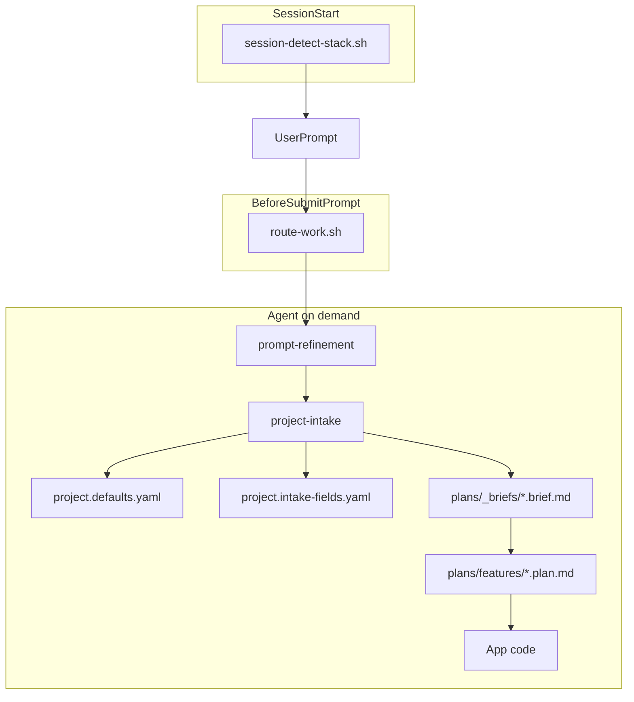

# Cursor Agent Kit

[English](README.md) · **Türkçe**

Cursor IDE için taşınabilir **`.cursor/`** şablonu — uygulama kodu değil, herhangi bir repo için agent orkestrasyonu.

Rastgele AI prompt'larını tekrarlanabilir bir akışla değiştirir: **prompt netleştirme → gereksinim çıkarımı → brief → plan → implement**. Takım varsayılanları, hook'lar, kurallar ve özelleşmiş skill'lerle desteklenir.

Tek script ile herhangi bir projeye kurulur. Git'te bir kez yapılandırılır. Her oturum aynı standartları devralır.

## Neden bu kit?

Yapı olmadan AI kod asistanları gereksinimleri atlar, planlama ile implementasyonu karıştırır ve tutarsız stack seçer. Bu kit somut artifact'ler ve otomasyonla bunu çözer:

- **Intake öncesi prompt netleştirme** — Belirsiz greenfield/plan/tasarım/scaffold prompt'larında [route-work.sh](.cursor/hooks/route-work.sh) [prompt-refinement/SKILL.md](.cursor/skills/prompt-refinement/SKILL.md)'i tetikler; agent yapılandırılmış prompt sunar, onay bekler, sonra devam eder. Config: `intake.prompt_refinement` (`auto` | `on-request` | `off`) — [project.defaults.yaml](.cursor/config/project.defaults.yaml).
- **Koddan önce yapılandırılmış intake** — [route-work.sh](.cursor/hooks/route-work.sh) greenfield/plan/tasarımda [project-intake/SKILL.md](.cursor/skills/project-intake/SKILL.md)'i lazy yükler; repo sinyallerini çıkarır, yalnızca eksik alanları `AskQuestion` ile sorar, onaylı [brief'leri](.cursor/plans/_briefs/) kaydeder.
- **Plan/implement ayrımı** — Implementasyon sırasında plan gövdesi salt okunur kalır; yalnızca `todos[].status` değişir ([feature-plan.template.md](.cursor/plans/_templates/feature-plan.template.md)).
- **Git'te takım standartları** — [project.defaults.yaml](.cursor/config/project.defaults.yaml) locale, mimari, stack ve intake kurallarını tutar; [project.intake-fields.yaml](.cursor/config/project.intake-fields.yaml) AskQuestion kataloğunu tutar (yalnızca intake'ta okunur). Çözümleme sırası: **kullanıcı prompt'u → repo sinyalleri → config varsayılanları → AskQuestion**.
- **Otomatik skill yönlendirme** — [route-work.sh](.cursor/hooks/route-work.sh) ve [registry.json](.cursor/skills/skills-router/registry.json) niyeti eşleştirir (greenfield, tasarım, scaffold, API inceleme, secops, handoff, MCP sunucu vb.); her seferinde `@skill` yazmaya gerek kalmaz.
- **Paralel subagent'lar** — [agents/](.cursor/agents/) altında 11 özel agent: repo keşfi, brief/plan doğrulama, bağımlılık izleme, güvenlik taraması, handoff artifact toplama — skill'lerdeki `## Subagent delegation` notlarına göre.
- **Slash command'lar** — [commands/](.cursor/commands/) altında 17 `/` iş akışı (`/plan`, `/intake`, `/fix`, `/status`, …) hook yönlendirmesine ek olarak bilinçli manuel tetikleme.
- **Davranış korkulukları** — Tek always-on kural [core.mdc](.cursor/rules/core.mdc) (~350 token); glob kurallar [quality-standards.mdc](.cursor/rules/quality-standards.mdc) yalnızca UI dosyalarında.
- **Bağlam görünürlüğü** — Her prompt'ta ekranda hangi rule/skill'in aktif olduğu ve tahmini token yükü gösterilir ([route_engine.py](.cursor/hooks/lib/route_engine.py), [context-manifest.json](.cursor/config/context-manifest.json)).
- **Yerleşik doğrulama** — [verification.md](.cursor/plans/_shared/verification.md) implement yolunda hook'lar tarafından referans alınır.
- **Otomatik ekran testi + döküman** — UI ekranı değiştiğinde [screen-test-protocol/SKILL.md](.cursor/skills/screen-test-protocol/SKILL.md) `cursor-ide-browser` ile test eder (giriş, tıklama, form doldur/sil/düzelt) ve `user_test/<app>/` altında ekran ekran test dökümanı yazar.
- **Proje bağımsız** — Node, .NET, Python, Go ve monorepo'larda çalışır; stack oturum başında algılanır ([session-detect-stack.sh](.cursor/hooks/session-detect-stack.sh)).

## Nasıl çalışır?

Hook'lar niyet eşleştiğinde bağlam enjekte eder. Tek always-on kural (`core.mdc`). Skill'ler ihtiyaç halinde yüklenir.



### Hook referansı

| Olay | Script | Etki |
|------|--------|------|
| `sessionStart` | `session-detect-stack.sh` | `[Stack:…]` repo sinyallerini enjekte eder (kısa) |
| `beforeSubmitPrompt` | `log-task-start.sh` | Görev başlangıç zamanını `.cursor/logs/agent-activity.log`'a yazar + ekrana not |
| `beforeSubmitPrompt` | `route-work.sh` | Niyet + skill router + ekranda bağlam raporu |
| `beforeReadFile` | `track-context-read.sh` | Okunan rule/skill dosyalarını oturumda izler |
| `stop` | `log-task-end.sh` | Görev bitiş zamanı + süresini yazar |

Aktivite logu her görevin başlangıç/bitiş zamanını ve süresini tutar. Token/maliyet bilgisi hook'lara **gelmez** — Cursor **Settings → Usage** veya mesaj başındaki göstergeden bakın.

## Hızlı başlangıç

### macOS / Linux

```bash
# 1. Clone (bir kez)
git clone https://github.com/YOUR_USER/cursor-agent-kit.git
cd cursor-agent-kit

# 2. Projenize kurun
./install.sh /path/to/your-project

# 3. Varsayılanları yapılandırın (locale, stack, mimari)
# Düzenleyin: your-project/.cursor/config/project.defaults.yaml
```

### Windows

```cmd
git clone https://github.com/YOUR_USER/cursor-agent-kit.git
cd cursor-agent-kit

install.bat C:\path\to\your-project
REM veya: install.bat . --force
```

Ardından **projenizi** Cursor'da açın. `.cursor/hooks.json` altındaki hook'lar otomatik yüklenir.

## Kurulum seçenekleri

| Komut | Etki |
|-------|------|
| `./install.sh ~/dev/my-app` | `.cursor/` dizinini `my-app/.cursor/` içine kopyalar (macOS/Linux) |
| `install.bat C:\dev\my-app` | Windows'ta aynı işlem |
| `./install.sh .` / `install.bat .` | Geçerli dizine kurar |
| `... --force` | Mevcut `.cursor`'ı değiştirir (eski → `.cursor.bak.<timestamp>`) |

### Clone olmadan (tek satır)

```bash
git clone --depth 1 https://github.com/YOUR_USER/cursor-agent-kit.git /tmp/cursor-agent-kit
/tmp/cursor-agent-kit/install.sh /path/to/your-project
```

### Git submodule (takım sabitleme)

```bash
cd your-project
git submodule add https://github.com/YOUR_USER/cursor-agent-kit.git .cursor-kit
.cursor-kit/install.sh . --force   # veya symlink: ln -s .cursor-kit/.cursor .cursor
```

## Kurulum sonrası — yapılandırma

**`your-project/.cursor/config/project.defaults.yaml`** dosyasını düzenleyin:

```yaml
locale:
  chat: turkish              # yanıt dili
  plan: english              # brief ve plan dosya dili
  ask_question_labels: english

architecture:
  default: fullstack-separated
  frontend:
    default_language: typescript
    default_framework: react
  backend:
    default_language: csharp-dotnet
    default_framework: aspnet-core

intake:
  prompt_refinement: auto          # auto | on-request | off
  prompt_refinement_min_words: 20  # auto: kısa/belirsiz prompt'larda tetiklenir
```

Çözümleme sırası: eksik alanlar için **kullanıcı prompt'u → repo sinyalleri → config varsayılanları → AskQuestion**.

Detaylar: [config/README.md](.cursor/config/README.md)

## Ne kurulur?

| Yol | Rol |
|-----|-----|
| `config/` | Takım varsayılanları + intake alan kataloğu |
| `rules/core.mdc` | Tek always-on agent davranışı (~350 token) |
| `rules/*.mdc` | Lazy/glob kurallar (intake workflow, kalite, ekran testi) |
| `hooks/` + `hooks.json` | sessionStart + beforeSubmitPrompt otomasyonu |
| `skills/` | Özelleşmiş iş akışları (intake, plan, tasarım, scaffold, secops, …) |
| `agents/` | Özel subagent'lar — paralel keşif, doğrulama, shell taraması (11) |
| `commands/` | Slash command'lar — manuel iş akışı kısayolları (17) |
| `plans/_briefs/` | Üretilen gereksinim brief'leri (proje bazlı) |
| `plans/features/` | Üretilen implementasyon planları |
| `plans/_shared/` | Kanonik seçenekler, locale, doğrulama |
| `plans/_templates/` | Brief, plan ve tasarım şablonları |
| `docs/` | Örnek promptlar ([EN](.cursor/docs/example-prompts.md) · [TR](.cursor/docs/example-prompts.tr.md)) |

Kurulum ayrıca hedef projeye kardeş bir **`user_test/`** klasörü (ekran-testi dökümanları + generic şablonlar) iskeleter; app bazlı dökümanlar talep üzerine üretilir ve yeniden kurulumda üzerine yazılmaz.

**Derinlemesine:** [.cursor/README.md](.cursor/README.md) (subagent'lar, command'lar, delegasyon matrisi) · [config/README.md](.cursor/config/README.md) · [example prompts (EN)](.cursor/docs/example-prompts.md) · [örnek promptlar (TR)](.cursor/docs/example-prompts.tr.md)

## Subagent'lar ve slash command'lar

| Katman | Yol | Rol |
|--------|-----|-----|
| Hook'lar | [route_engine.py](.cursor/hooks/lib/route_engine.py) + [registry.json](.cursor/skills/skills-router/registry.json) | Deterministik intent + skill yönlendirme |
| Skill'ler | [skills/](.cursor/skills/) | İş akışı; `## Subagent delegation` ne zaman yardımcı başlatılır |
| Subagent'lar | [agents/](.cursor/agents/) | Paralel readonly veya shell işleri |
| Command'lar | [commands/](.cursor/commands/) | Kullanıcı `/` kısayolları |

**Subagent'lar (11):** `repo-explorer`, `brief-validator`, `plan-reviewer`, `dependency-tracer`, `route-mapper`, `command-validator`, `audit-runner`, `security-scanner`, `openapi-linter`, `schema-reviewer`, `artifact-collector`.

**Command'lar (17):** `/refine`, `/intake`, `/plan`, `/implement`, `/scaffold`, `/design`, `/fix`, `/screen-test`, `/handoff`, `/onboard`, `/audit-deps`, `/security`, `/api-review`, `/ci`, `/skip-intake`, `/skip-refine`, `/status`.

Tam tablolar: [.cursor/README.md](.cursor/README.md#subagents-and-commands). **Örnek promptlar:** [EN](.cursor/docs/example-prompts.md) · [TR](.cursor/docs/example-prompts.tr.md).

## Dahil skill'ler

Skill'ler, agent'a **belirli bir iş türünde nasıl davranacağını** öğreten talimat dosyalarıdır. [route-work.sh](.cursor/hooks/route-work.sh) [registry.json](.cursor/skills/skills-router/registry.json) ile otomatik yönlendirir; istenirse `@skill-adı` ile manuel de çağrılır.

### Ana iş akışı skill'leri

**Netleştir → brief → plan → kod** zincirini yönetir.

| Skill | Ne işe yarar | Ne zaman |
|-------|--------------|----------|
| [prompt-refinement](.cursor/skills/prompt-refinement/SKILL.md) | Intake veya planlamadan önce belirsiz prompt'ları netleştirir: hedef/kapsam/kısıt çıkarımı, kritik belirsizlikleri sorar, yapılandırılmış prompt sunar, onay bekler. Henüz kod, brief veya plan **yazmaz**. | Greenfield/plan/tasarım/scaffold ve hook `[route:prompt-refinement]` yönlendirdiğinde veya "prompt geliştir" denildiğinde. |
| [project-intake](.cursor/skills/project-intake/SKILL.md) | Koddan önce gereksinim toplar: repo + prompt çıkarımı, eksik alanları `AskQuestion` ile sorar, onaylı brief'i `plans/_briefs/*.brief.md` olarak kaydeder, sonraki skill'e yönlendirir. | Greenfield, yeni özellik, plan/tasarım/scaffold — brief yokken. |
| [implementation-plan](.cursor/skills/implementation-plan/SKILL.md) | Onaylı brief'ten uygulama planı yazar (ekran envanteri, gap analizi, todo'lar). Uygulama kodu **yazmaz**. | "Plan oluştur", "implementation plan" — **"planı uygula" değil**. |
| [design-intake](.cursor/skills/design-intake/SKILL.md) | UI/tasarım intake: estetik, tema, motion, component stack; `plans/design-*.plan.md` üretir. | "Tasarım", "mockup", "redesign", "UI oluştur". |
| [module-scaffolder](.cursor/skills/module-scaffolder/SKILL.md) | Brief'e göre yeni modül/ekran iskeleti: stack'e uygun dosya ağacı (sayfa, route, CRUD form, API endpoint). | "Scaffold", "yeni modül", "yeni ekran", "feature ekle". |
| [focused-fix](.cursor/skills/focused-fix/SKILL.md) | Kırık bir feature/modülü uçtan uca onarır — bağımlılık, log, test, config katmanlarını sistematik tarar. **Tek satırlık bug fix için değil.** | "X'i çalışır hale getir", "modül bozuk", "uçtan uca düzelt". |
| [screen-test-protocol](.cursor/skills/screen-test-protocol/SKILL.md) | `cursor-ide-browser` ile smoke test + `user_test/<app>/` dökümanı. Browser öncesi `route-mapper` delegasyonu. | UI değişikliği, "ekran testi". |
| [handoff](.cursor/skills/handoff/SKILL.md) | Oturumu handoff dökümanına sıkıştırır; `artifact-collector` delegasyonu. | "Devret", "oturumu bitir", `/handoff`. |
| [mcp-server-builder](.cursor/skills/mcp-server-builder/SKILL.md) | OpenAPI'den MCP sunucusu. | "MCP server", "API'yi MCP olarak expose et". |

### Uzmanlık skill'leri

Belirli teknik alanlarda derin rehberlik. Prompt anahtar kelimeleri eşleşince hook otomatik yönlendirir.

| Skill | Ne işe yarar | Ne zaman |
|-------|--------------|----------|
| [api-design-reviewer](.cursor/skills/api-design-reviewer/SKILL.md) | REST API tasarım incelemesi: isimlendirme, HTTP metotları, status code, breaking change, OpenAPI, versiyonlama, hata formatı, skor kartı. | API PR incelemesi, v2 migrasyonu, endpoint ekleme/değiştirme. |
| [dependency-auditor](.cursor/skills/dependency-auditor/SKILL.md) | Bağımlılık denetimi: CVE, transitive risk, lisans çakışması, güvenli upgrade yolu. | "CVE", "npm audit", release öncesi, lisans uyumu. |
| [ci-cd-pipeline-builder](.cursor/skills/ci-cd-pipeline-builder/SKILL.md) | Repodaki stack sinyallerinden CI/CD pipeline (GitHub Actions, GitLab CI; lint/test/build/deploy). | "CI kur", "pipeline oluştur", "GitHub Actions". |
| [codebase-onboarding](.cursor/skills/codebase-onboarding/SKILL.md) | Repoyu analiz edip onboarding dökümanı: mimari, önemli dosyalar, local setup, katkı checklist'i. | Yeni geliştirici, "proje nasıl çalışıyor", mimari özet. |
| [database-schema-designer](.cursor/skills/database-schema-designer/SKILL.md) | Veritabanı şeması: ERD, normalizasyon, migration (Drizzle/Prisma/TypeORM/Alembic), index, RLS, seed. | "ERD", "şema tasarla", "migration planla", tablo ilişkileri. |
| [senior-secops](.cursor/skills/senior-secops/SKILL.md) | Uygulama güvenliği: SAST, OWASP Top 10, secret taraması, tehdit modeli, hardening, SOC2/PCI/HIPAA/GDPR. | Güvenlik taraması, pentest hazırlığı, zafiyet yönetimi. |
| [skill-creator](.cursor/skills/skill-creator/SKILL.md) | Skill oluşturma, test ve iyileştirme: SKILL.md taslağı, eval, tetikleme benchmark, description optimizasyonu. | "skill oluştur", "skill eval", "skill optimize". |
| [pdf-tools](.cursor/skills/pdf-tools/SKILL.md) | PDF birleştirme/bölme/çıkarma/şifreleme — `pypdf`, `pdfplumber` (açık kaynak). | `.pdf`, pdf birleştir, tablo çıkar. |
| [xlsx-tools](.cursor/skills/xlsx-tools/SKILL.md) | Tablo okuma/yazma — `openpyxl`, `pandas`; Excel formülleri, hardcode değil. | `.xlsx`, excel, csv dönüşüm. |
| [docx-tools](.cursor/skills/docx-tools/SKILL.md) | Word belgeleri — `python-docx`, `pandoc` (açık kaynak). | `.docx`, rapor, memo, mektup. |
| [pptx-tools](.cursor/skills/pptx-tools/SKILL.md) | Sunumlar — `python-pptx` (açık kaynak). | `.pptx`, slides, sunum. |

### Hook tetikleyici ifadeleri

[registry.json](.cursor/skills/skills-router/registry.json) üzerinden otomatik eşleşir. İngilizce ve Türkçe desteklenir.

| Skill | Tetikleyiciler (örnek) |
|-------|------------------------|
| prompt-refinement | prompt geliştir, refine prompt, netleştir |
| project-intake | greenfield, sıfırdan, from scratch |
| module-scaffolder | scaffold, yeni modül, new screen |
| focused-fix | fix feature, uçtan uca, broken |
| implementation-plan | plan oluştur, implementation plan |
| design-intake | tasarım, mockup, redesign |
| api-design-reviewer | openapi, REST API, breaking change |
| dependency-auditor | CVE, npm audit, license |
| ci-cd-pipeline-builder | GitHub Actions, pipeline |
| codebase-onboarding | onboarding, repo overview |
| database-schema-designer | ERD, schema migration |
| senior-secops | security scan, pentest, hardening |
| screen-test-protocol | ekran testi, screen test, smoke test |
| handoff | hand this off, oturumu bitir, devret |
| mcp-server-builder | mcp server, expose api as mcp |
| skill-creator | skill oluştur, skill eval |
| pdf-tools | .pdf, pdf birleştir |
| xlsx-tools | .xlsx, excel, tablo |
| docx-tools | .docx, word belgesi |
| pptx-tools | .pptx, sunum, slides |

### Slash command'lar (manuel tetikleme)

Chat'te `/komut` yazın. Tüm liste: [.cursor/README.md](.cursor/README.md#slash-commands-17).

| Command | Amaç |
|---------|------|
| `/plan` | implementation-plan + repo-explorer + plan-reviewer |
| `/intake` | project-intake + repo-explorer + brief-validator |
| `/implement` | Plan uygula — gövde salt okunur |
| `/fix` | focused-fix + dependency-tracer |
| `/status` | Brief, plan, git, son bağlam raporu |

### Yalnızca @skill ile

Hook registry'sinde yok; gerektiğinde manuel çağırın:

| Skill | Ne işe yarar |
|-------|--------------|
| [cursor-guidelines](.cursor/skills/cursor-guidelines/SKILL.md) | Stub — kanonik disiplin [core.mdc](.cursor/rules/core.mdc) içinde. |

## Tipik iş akışı

1. **Greenfield / yeni özellik** → prompt netleştirme (açıksa) → kullanıcı onayı → intake → `plans/_briefs/*.brief.md`
2. **Plan** → `plans/features/*.plan.md` (koddan önce onay)
3. **Planı uygula** → uygulama kodunuzda değişiklik; yalnızca plan `todos[].status` güncellenir

**Refinement şu durumlarda atlanır:**

- `skip refinement` / `refinement atla` derseniz
- `implement the plan` / `Planı uygula` derseniz
- Görev kapsamlı bir bugfix veya refactor ise
- Config'te `intake.prompt_refinement: off` ise
- Prompt zaten detaylı veya refined olarak işaretliyse

**Intake şu durumlarda atlanır:**

- `implement the plan` / `Planı uygula` derseniz (mevcut plan kullanılır)
- `skip intake` / `intake atla` derseniz (yalnızca config varsayılanları; sorumluluk sizde)
- Eşleşen `plans/_briefs/*.brief.md` zaten varsa
- Görev kapsamlı bir bugfix veya refactor ise

**Örnek prompt'lar:**

- `Sıfırdan Next.js admin paneli planla` (refinement → intake → plan)
- `prompt geliştir: e-ticaret admin paneli` (`on-request` modunda refinement zorlar)
- `Planı uygula` (mevcut plan; refinement + intake atlanır)
- `skip refinement` / `skip intake` (ilgili kapıları atlar)

## Repo yapısı (bu repo)

| Yol | Amaç |
|-----|------|
| `.cursor/` | Tüketici projelere kopyalanan şablon |
| `user_test/` | Ekran-testi döküman tohumu (şablonlar + index), `.cursor/` ile birlikte kopyalanır |
| `install.sh` | Kurulum script'i (macOS / Linux) |
| `install.bat` | Kurulum script'i (Windows) |
| `README.md` | İngilizce dokümantasyon |
| `README.tr.md` | Bu dosya |

## GitHub'a yayınlama

```bash
cd cursor-agent-kit
git init
git add .
git commit -m "Initial commit: Cursor agent kit template"
git branch -M main
git remote add origin https://github.com/YOUR_USER/cursor-agent-kit.git
git push -u origin main
```

## Mevcut projeyi güncelleme

```bash
cd cursor-agent-kit && git pull
./install.sh /path/to/your-project --force
# Üzerine yazılırsa project.defaults.yaml değişikliklerinizi yeniden uygulayın (önce yedekleyin)
```

`--force` tüm `.cursor` ağacını değiştirir (eski kopya `.cursor.bak.<timestamp>` olarak yedeklenir). Güncellemeden önce `project.defaults.yaml` farklarınızı yedekleyin veya dokümante edin.

## Lisans

[MIT](LICENSE)
