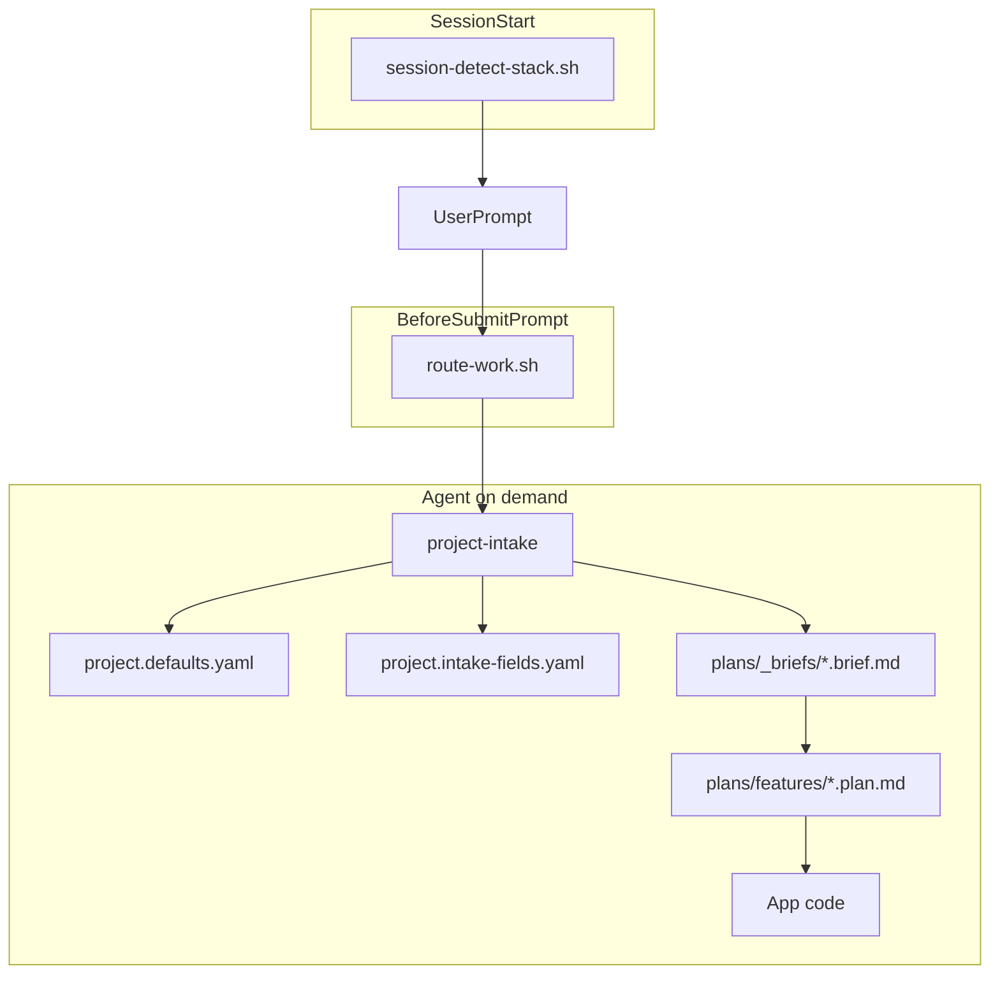

# Cursor Agent Kit

[English](README.md) · **Türkçe**

Cursor IDE için taşınabilir **`.cursor/`** şablonu — uygulama kodu değil, herhangi bir repo için agent orkestrasyonu.

Rastgele AI prompt'larını tekrarlanabilir bir akışla değiştirir: **gereksinim çıkarımı → brief → plan → implement**. Takım varsayılanları, hook'lar, kurallar ve özelleşmiş skill'lerle desteklenir.

Tek script ile herhangi bir projeye kurulur. Git'te bir kez yapılandırılır. Her oturum aynı standartları devralır.

## Neden bu kit?

Yapı olmadan AI kod asistanları gereksinimleri atlar, planlama ile implementasyonu karıştırır ve tutarsız stack seçer. Bu kit somut artifact'ler ve otomasyonla bunu çözer:

- **Koddan önce yapılandırılmış intake** — [route-work.sh](.cursor/hooks/route-work.sh) greenfield/plan/tasarımda [project-intake/SKILL.md](.cursor/skills/project-intake/SKILL.md)'i lazy yükler; repo sinyallerini çıkarır, yalnızca eksik alanları `AskQuestion` ile sorar, onaylı [brief'leri](.cursor/plans/_briefs/) kaydeder.
- **Plan/implement ayrımı** — Implementasyon sırasında plan gövdesi salt okunur kalır; yalnızca `todos[].status` değişir ([feature-plan.template.md](.cursor/plans/_templates/feature-plan.template.md)).
- **Git'te takım standartları** — [project.defaults.yaml](.cursor/config/project.defaults.yaml) locale, mimari, stack ve intake kurallarını tutar; [project.intake-fields.yaml](.cursor/config/project.intake-fields.yaml) AskQuestion kataloğunu tutar (yalnızca intake'ta okunur). Çözümleme sırası: **kullanıcı prompt'u → repo sinyalleri → config varsayılanları → AskQuestion**.
- **Otomatik skill yönlendirme** — [route-work.sh](.cursor/hooks/route-work.sh) ve [registry.json](.cursor/skills/claude-skills-router/registry.json) niyeti eşleştirir (greenfield, tasarım, scaffold, API inceleme, secops vb.); her seferinde `@skill` yazmaya gerek kalmaz.
- **Davranış korkulukları** — Tek always-on kural [core.mdc](.cursor/rules/core.mdc) (~400 token); glob kurallar [quality-standards.mdc](.cursor/rules/quality-standards.mdc) yalnızca UI dosyalarında.
- **Yerleşik doğrulama** — [verification.md](.cursor/plans/_shared/verification.md) implement yolunda hook'lar tarafından referans alınır.
- **Otomatik ekran testi + döküman** — UI ekranı değiştiğinde [screen-test-protocol/SKILL.md](.cursor/skills/screen-test-protocol/SKILL.md) `cursor-ide-browser` ile test eder (giriş, tıklama, form doldur/sil/düzelt) ve `user_test/<app>/` altında ekran ekran test dökümanı yazar.
- **Proje bağımsız** — Node, .NET, Python, Go ve monorepo'larda çalışır; stack oturum başında algılanır ([session-detect-stack.sh](.cursor/hooks/session-detect-stack.sh)).

## Nasıl çalışır?

Hook'lar niyet eşleştiğinde bağlam enjekte eder. Tek always-on kural (`core.mdc`). Skill'ler ihtiyaç halinde yüklenir.



### Hook referansı

| Olay | Script | Etki |
|------|--------|------|
| `sessionStart` | `session-detect-stack.sh` | `[Stack:…]` repo sinyallerini enjekte eder (kısa) |
| `beforeSubmitPrompt` | `log-task-start.sh` | Görev başlangıç zamanını `.cursor/logs/agent-activity.log`'a yazar + ekrana not |
| `beforeSubmitPrompt` | `route-work.sh` | Niyet sınıflandırma + intake gate + skill router (3 eski hook'un yerine) |
| `stop` | `log-task-end.sh` | Görev bitiş zamanı + süresini yazar |

Aktivite logu her görevin başlangıç/bitiş zamanını ve süresini tutar. Token/maliyet bilgisi hook'lara **gelmez** — Cursor **Settings → Usage** veya mesaj başındaki göstergeden bakın.

## Hızlı başlangıç

### macOS / Linux

```bash
# 1. Clone (bir kez)
git clone https://github.com/YOUR_USER/cursor-agent-kit.git
cd cursor-agent-kit

# 2. Projenize kurun
./install.sh /path/to/your-project

# 3. Varsayılanları yapılandırın (locale, stack, mimari)
# Düzenleyin: your-project/.cursor/config/project.defaults.yaml
```

### Windows

```cmd
git clone https://github.com/YOUR_USER/cursor-agent-kit.git
cd cursor-agent-kit

install.bat C:\path\to\your-project
REM veya: install.bat . --force
```

Ardından **projenizi** Cursor'da açın. `.cursor/hooks.json` altındaki hook'lar otomatik yüklenir.

## Kurulum seçenekleri

| Komut | Etki |
|-------|------|
| `./install.sh ~/dev/my-app` | `.cursor/` dizinini `my-app/.cursor/` içine kopyalar (macOS/Linux) |
| `install.bat C:\dev\my-app` | Windows'ta aynı işlem |
| `./install.sh .` / `install.bat .` | Geçerli dizine kurar |
| `... --force` | Mevcut `.cursor`'ı değiştirir (eski → `.cursor.bak.<timestamp>`) |

### Clone olmadan (tek satır)

```bash
git clone --depth 1 https://github.com/YOUR_USER/cursor-agent-kit.git /tmp/cursor-agent-kit
/tmp/cursor-agent-kit/install.sh /path/to/your-project
```

### Git submodule (takım sabitleme)

```bash
cd your-project
git submodule add https://github.com/YOUR_USER/cursor-agent-kit.git .cursor-kit
.cursor-kit/install.sh . --force   # veya symlink: ln -s .cursor-kit/.cursor .cursor
```

## Kurulum sonrası — yapılandırma

**`your-project/.cursor/config/project.defaults.yaml`** dosyasını düzenleyin:

```yaml
locale:
  chat: turkish              # yanıt dili
  plan: english              # brief ve plan dosya dili
  ask_question_labels: english

architecture:
  default: fullstack-separated
  frontend:
    default_language: typescript
    default_framework: react
  backend:
    default_language: csharp-dotnet
    default_framework: aspnet-core
```

Çözümleme sırası: eksik alanlar için **kullanıcı prompt'u → repo sinyalleri → config varsayılanları → AskQuestion**.

Detaylar: [config/README.md](.cursor/config/README.md)

## Ne kurulur?

| Yol | Rol |
|-----|-----|
| `config/` | Takım varsayılanları + intake alan kataloğu |
| `rules/core.mdc` | Tek always-on agent davranışı (~400 token) |
| `rules/*.mdc` | Lazy/glob kurallar (intake workflow, kalite, ekran testi) |
| `hooks/` + `hooks.json` | sessionStart + beforeSubmitPrompt otomasyonu |
| `skills/` | Özelleşmiş iş akışları (intake, plan, tasarım, scaffold, secops, …) |
| `plans/_briefs/` | Üretilen gereksinim brief'leri (proje bazlı) |
| `plans/features/` | Üretilen implementasyon planları |
| `plans/_shared/` | Kanonik seçenekler, locale, doğrulama |
| `plans/_templates/` | Brief, plan ve tasarım şablonları |

Kurulum ayrıca hedef projeye kardeş bir **`user_test/`** klasörü (ekran-testi dökümanları + generic şablonlar) iskeleter; app bazlı dökümanlar talep üzerine üretilir ve yeniden kurulumda üzerine yazılmaz.

**Derinlemesine:** [.cursor/README.md](.cursor/README.md) · [config/README.md](.cursor/config/README.md)

## Dahil skill'ler

### Hook ile yönlendirilen

[registry.json](.cursor/skills/claude-skills-router/registry.json) üzerinden otomatik eşleşir. Tetikleyici ifadeler İngilizce ve Türkçe destekler.

| Skill | Tetikleyiciler (örnek) |
|-------|------------------------|
| project-intake | greenfield, sıfırdan, from scratch |
| module-scaffolder | scaffold, yeni modül, new screen |
| focused-fix | fix feature, uçtan uca, broken |
| implementation-plan | plan oluştur, implementation plan |
| design-intake | tasarım, mockup, redesign |
| api-design-reviewer | openapi, REST API, breaking change |
| dependency-auditor | CVE, npm audit, license |
| ci-cd-pipeline-builder | GitHub Actions, pipeline |
| codebase-onboarding | onboarding, repo overview |
| database-schema-designer | ERD, schema migration |
| senior-secops | security scan, pentest, hardening |
| screen-test-protocol | ekran testi, screen test, smoke test |

### @skill ile kullanılabilir

Hook registry'sinde yok; gerektiğinde manuel çağırın:

- `handoff` — oturum devri için konuşmayı sıkıştırır
- `mcp-server-builder` — OpenAPI'den MCP sunucusu iskeleti
- `cursor-guidelines` — disiplin hatırlatıcısı (kanonik metin rules içinde)

## Tipik iş akışı

1. **Greenfield / yeni özellik** → agent intake çalıştırır → `plans/_briefs/*.brief.md`
2. **Plan** → `plans/features/*.plan.md` (koddan önce onay)
3. **Planı uygula** → uygulama kodunuzda değişiklik; yalnızca plan `todos[].status` güncellenir

**Intake şu durumlarda atlanır:**

- `implement the plan` / `Planı uygula` derseniz (mevcut plan kullanılır)
- `skip intake` / `intake atla` derseniz (yalnızca config varsayılanları; sorumluluk sizde)
- Eşleşen `plans/_briefs/*.brief.md` zaten varsa
- Görev kapsamlı bir bugfix veya refactor ise

**Örnek prompt'lar:**

- `Sıfırdan Next.js admin paneli planla`
- `Planı uygula` (mevcut planı kullanır; intake atlanır)
- `skip intake` (yalnızca config varsayılanları)

## Repo yapısı (bu repo)

| Yol | Amaç |
|-----|------|
| `.cursor/` | Tüketici projelere kopyalanan şablon |
| `user_test/` | Ekran-testi döküman tohumu (şablonlar + index), `.cursor/` ile birlikte kopyalanır |
| `install.sh` | Kurulum script'i (macOS / Linux) |
| `install.bat` | Kurulum script'i (Windows) |
| `README.md` | İngilizce dokümantasyon |
| `README.tr.md` | Bu dosya |

## GitHub'a yayınlama

```bash
cd cursor-agent-kit
git init
git add .
git commit -m "Initial commit: Cursor agent kit template"
git branch -M main
git remote add origin https://github.com/YOUR_USER/cursor-agent-kit.git
git push -u origin main
```

## Mevcut projeyi güncelleme

```bash
cd cursor-agent-kit && git pull
./install.sh /path/to/your-project --force
# Üzerine yazılırsa project.defaults.yaml değişikliklerinizi yeniden uygulayın (önce yedekleyin)
```

`--force` tüm `.cursor` ağacını değiştirir (eski kopya `.cursor.bak.<timestamp>` olarak yedeklenir). Güncellemeden önce `project.defaults.yaml` farklarınızı yedekleyin veya dokümante edin.

## Lisans

MIT (gerekirse LICENSE dosyası ekleyin)
